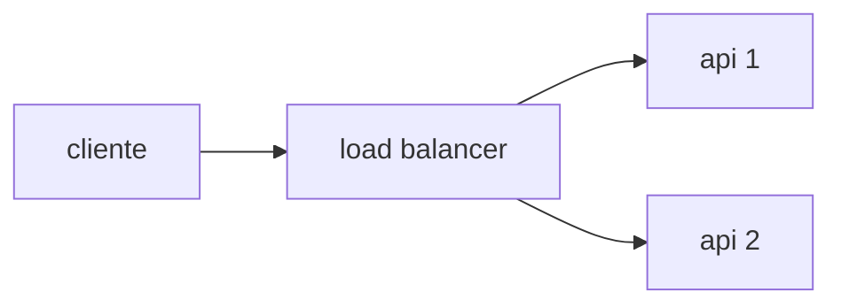

# Arquitetura e restrições

## Topologia

Seu backend precisa conter pelo menos **um load balancer e duas instâncias de APIs web**. Você pode ou não usar um banco de dados, um middleware, mais instâncias de APIs, etc. O importante é ter um load balancer distribuindo carga igualmente (round-robin simples) entre **pelo menos** duas instâncias de API.



**IMPORTANTE!**: Seu load balancer não pode processar as requisições da perspectiva de lógica de negócio (inspecionar o payload, fazer condicionais, responder requisições HTTP antes de redirecionar para servidores upstream, etc.). Ou seja, nada de *\~smart\~ load balancing*!

## Conteinerização

Seu backend precisa ser disponibilizado como uma declaração no formato do docker compose. Todas as imagens declaradas no arquivo `docker-compose.yml` precisam estar publicamente disponíveis.

Você deverá restringir o uso de CPU e memória em 1 unidade de CPU e 350MB de memória entre todos os serviços declarados no `docker-compose.yml` – a soma dos limites de todos os recursos deve ser de 1 unidade de CPU e 350MB de memória; distribua como quiser. Exemplo de como restringir recursos:

```YML
services:
  seu-servico:
    ...
    deploy:
      resources:
        limits:
          cpus: "0.15"
          memory: "42MB"
```

A conteinerização precisa estar disponível na branch `submission`, como [descrito aqui](./SUBMISSAO.md). 

## A porta 9999

Seu backend precisam responder na porta **9999**. Ou seja, o load balancer da sua solução precisa responder às requisições nessa porta.

**Outas restrições**
- As imagens devem ser compatíveis com linux-amd64 (especialmente importante para quem usa Mac com processadores ARM64 - [referência](https://docs.docker.com/build/building/multi-platform/)).
- O modo de rede deve ser bridge – o modo host não é permitido.
- Não é permitido modo privileged.
