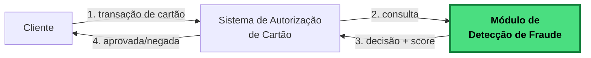

# Rinha de Backend 2026 – Detecção de fraude por busca vetorial!

## Sobre esta edição

O desafio é construir uma **API de detecção de fraude em autorizações de cartão**. Para cada transação, sua API faz uma **busca vetorial** num dataset com referências de transações e decide se aprova ou nega junto com um score de fraude.



O módulo destacado em verde é **o que você vai construir**.


## O básico do desafio

1. A API recebe um `POST /fraud-score` com os dados da transação.
1. Normaliza os campos em um vetor de 14 dimensões (valores entre `0.0` e `1.0`).
1. Faz uma **busca vetorial** no dataset de referência.
1. Pega os `K=5` vizinhos mais próximos e faz votação por maioria.
1. Retorna `{ approved, fraud_score }`, por exemplo:
   ```json
   { "approved": false, "fraud_score": 0.8 }
   ```

E mais o clássico da Rinha: um load balancer com duas ou mais APIs e o perrengue de sempre com quase nada de memória e ainda menos CPU.

---

## Roteiro de leitura

Aqui está uma sugestão de ordem para leitura da documentação da edição desse ano.

### 1. O que você precisa construir

- **[API.md](./API.md)** — Contrato da API que precisa ser construída (`POST /fraud-score`, `GET /ready`).
- **[ARQUITETURA.md](./ARQUITETURA.md)** — Limites de CPU/memória, arquitetura mímina, conteineriezação.

### 2. Como funciona a detecção de fraude

- **[REGRAS_DE_DETECCAO.md](./REGRAS_DE_DETECCAO.md)** — **As regras que definem a detecção de fraude**: as 14 dimensões do vetor, fórmulas de normalização, como cada campo do payload deve ser tratado para a busca vetorial e exemplos completos do fluxo. *A especificação do que você precisa implementar.*
- **[BUSCA_VETORIAL.md](./BUSCA_VETORIAL.md)** — O que é uma busca vetorial, com exemplos passo-a-passo. *Essencial se você nunca trabalhou com vetores.*

### 3. Os dados

- **[DATASET.md](./DATASET.md)** — Formato dos arquivos de referência (`references.json.gz`, `mcc_risk.json`, `normalization.json`).

### 4. Participação e avaliação

- **[SUBMISSAO.md](./SUBMISSAO.md)** — Passo-a-passo do PR, branches (`main` e `submission`), como abrir a issue `rinha/test`.
- **[AVALIACAO.md](./AVALIACAO.md)** — Fórmula de pontuação, peso de FP/FN, multiplicador de latência, como rodar o teste local.
- **[FAQ.md](./FAQ.md)** — Dúvidas recorrentes, armadilhas comuns, o que pode e não pode.

---
## Pontos em aberto
- Ambiente para os testes (testes ainda não estão sendo feitos)
- Definição de datas de encerramento para submissões e resultados finais
- Mecanismo para agregar a prévia dos resultados

---

[← README principal](../../README.md)