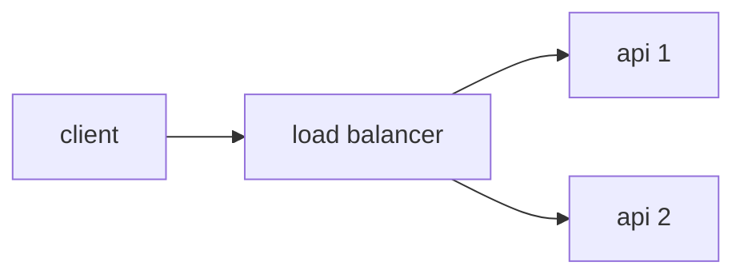

# Architecture and constraints

## Topology

Your backend needs to contain at least **one load balancer and two web API instances**. You may or may not use a database, middleware, more API instances, etc. The important thing is to have a load balancer distributing the load evenly (simple round-robin) across **at least** two API instances.



**IMPORTANT!**: Your load balancer cannot process requests from a business-logic perspective (inspecting the payload, doing conditionals, responding to HTTP requests before forwarding to upstream servers, etc.). In other words, no *\~smart\~ load balancing*!

## Containerization

Your backend must be made available as a docker compose declaration. All images declared in the `docker-compose.yml` file must be publicly available.

You must restrict CPU and memory usage to 1 CPU unit and 350MB of memory across all services declared in `docker-compose.yml` – the sum of all resource limits must be 1 CPU unit and 350MB of memory; distribute it however you like. Example of how to restrict resources:

```YML
services:
  your-service:
    ...
    deploy:
      resources:
        limits:
          cpus: "0.15"
          memory: "42MB"
```

The containerization must be available on the `submission` branch, as [described here](./SUBMISSION.md).

## Port 9999

Your backend must respond on port **9999**. That is, your solution's load balancer needs to respond to requests on this port.

**Other constraints**
- Images must be compatible with linux-amd64 (especially important for those using Mac with ARM64 processors - [reference](https://docs.docker.com/build/building/multi-platform/)).
- Network mode must be bridge – host mode is not allowed.
- Privileged mode is not allowed.
