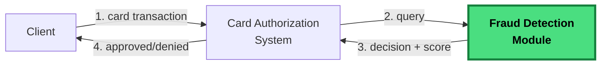

# Rinha de Backend 2026 – Fraud detection via vector search!

## About this edition

The challenge is to build a **fraud detection API for card authorizations**. For each transaction, your API performs a **vector search** on a dataset of reference transactions and decides whether to approve or deny it, along with a fraud score.



The module highlighted in green is **what you will build**.


## The basics of the challenge

1. The API receives a `POST /fraud-score` with the transaction data.
1. It normalizes the fields into a 14-dimensional vector (values between `0.0` and `1.0`).
1. Performs a **vector search** on the reference dataset.
1. Takes the `K=5` nearest neighbors and does majority voting.
1. Returns `{ approved, fraud_score }`, for example:
   ```json
   { "approved": false, "fraud_score": 0.8 }
   ```

Plus the Rinha classic: a load balancer with two or more APIs and the usual struggle with almost no memory and even less CPU.

---

## Reading roadmap

Here's a suggested reading order for this year's documentation.

### 1. What you need to build

- **[API.md](./API.md)** — The API contract you need to build (`POST /fraud-score`, `GET /ready`).
- **[ARCHITECTURE.md](./ARCHITECTURE.md)** — CPU/memory limits, minimum architecture, containerization.

### 2. How fraud detection works

- **[DETECTION_RULES.md](./DETECTION_RULES.md)** — **The rules that define fraud detection**: the 14 vector dimensions, normalization formulas, how each payload field should be handled for the vector search, and complete flow examples. *The specification of what you need to implement.*
- **[VECTOR_SEARCH.md](./VECTOR_SEARCH.md)** — What a vector search is, with step-by-step examples. *Essential if you've never worked with vectors.*

### 3. The data

- **[DATASET.md](./DATASET.md)** — Format of the reference files (`references.json.gz`, `mcc_risk.json`, `normalization.json`).

### 4. Participation and evaluation

- **[SUBMISSION.md](./SUBMISSION.md)** — Step-by-step PR guide, branches (`main` and `submission`), how to open the `rinha/test` issue.
- **[EVALUATION.md](./EVALUATION.md)** — Scoring formula, FP/FN weights, latency multiplier, how to run the test locally.
- **[FAQ.md](./FAQ.md)** — Frequently asked questions, common pitfalls, what's allowed and what isn't.

---
## Open points
- Environment for the tests (tests are not yet being run)
- Definition of deadlines for submissions and final results
- Mechanism to aggregate the preview of results

---

[← Main README](../../README.md)
